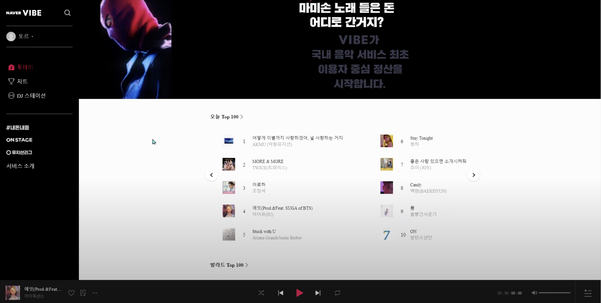
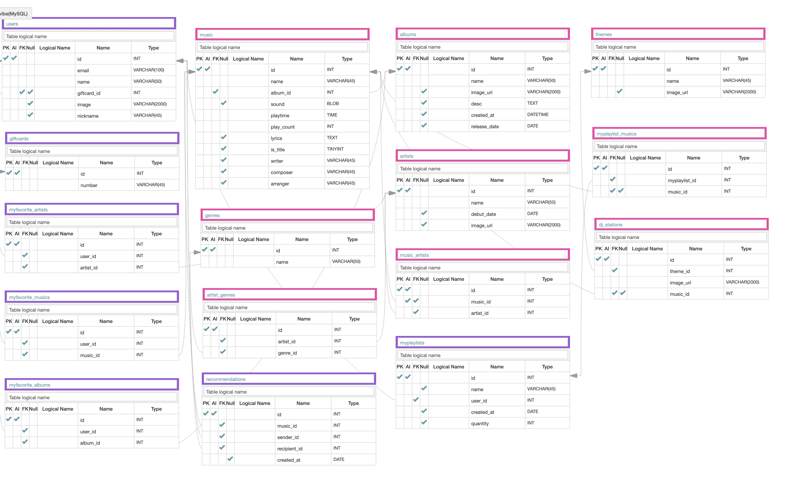

# Introduction
 - WeCode 8기 수강생들의 2차 프로젝트 - Vibe Website Clone Project
 - 기간 : 12일 (6월 8일 ~ 6월 19일)
 - 인원 : 5명 ( 3 Front-End , 2 Back-End )
 - [Front-End GitHub Repository](https://github.com/wecode-bootcamp-korea/FeelTheVibe-frontend)
 
 
 

 
 ## Demo
 
 
 
  
 
 ## Goal 
 
 - Trello를 사용하여 팀원끼리 원활한 소통과 협업으로 진행
 - 웹페이지의 구조와 기능 파악 후 동일하게 재현
 - 모델링을 기반으로 데이터베이스 생성 후 크롤링 한 데이터 삽입
 - 음악 스트리밍 서비스 기능 구현
 - 다양한 기준으로 필터링 된 차트 기능 구현
 - RESTful API 생성

 

 ## Technologies

- Python/Django
- Selenium, BeautifulSoup
- JWT, Bcrypt
- CORS Headers
- MySQL
- Docker

 

## Database ERD Modeling

 

## Features

### Account

- Naver Social Log-in API으로 JWT 토근을 생성하여 로그인 검증 및 유저 정보 저장
- 로그인 검증을 위한 login decorator 구현
- 내가 좋아요 한 노래 보관함 기능 구현

### Music
- 음악 스트리밍 기능 구현
- 재생 횟수 기준으로 국내 차트 100, 발라드 차트100 기능 구현
- 노래별 상세페이지 구현
- 나의 플레이리스트 생성 및 저장, 삭제 기능 구현
- 나의 플레이리스트 디테일 목록 기능 구현 (추가,삭제,좋아요 누르기)
- 플레이어에서 좋아요 누르기, 노래 추가 및 삭제 저장 기능 구현

## API Documentation
[Postman:api-documentation](https://documenter.getpostman.com/view/11390428/Szzn5bRp?version=latest)

